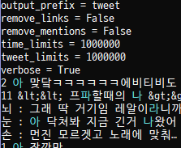
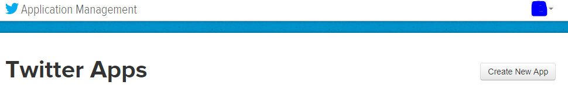
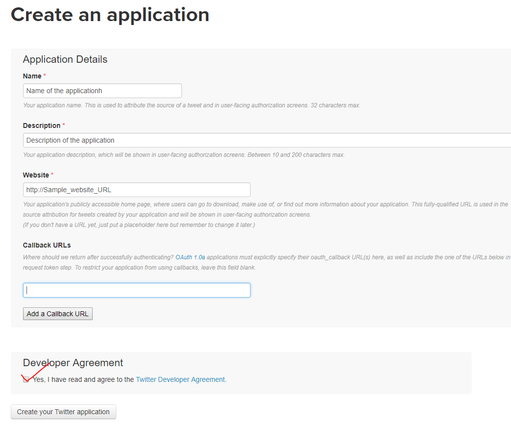
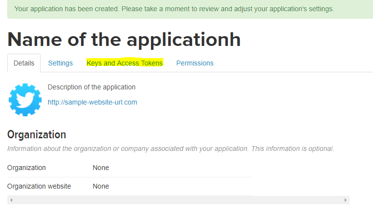
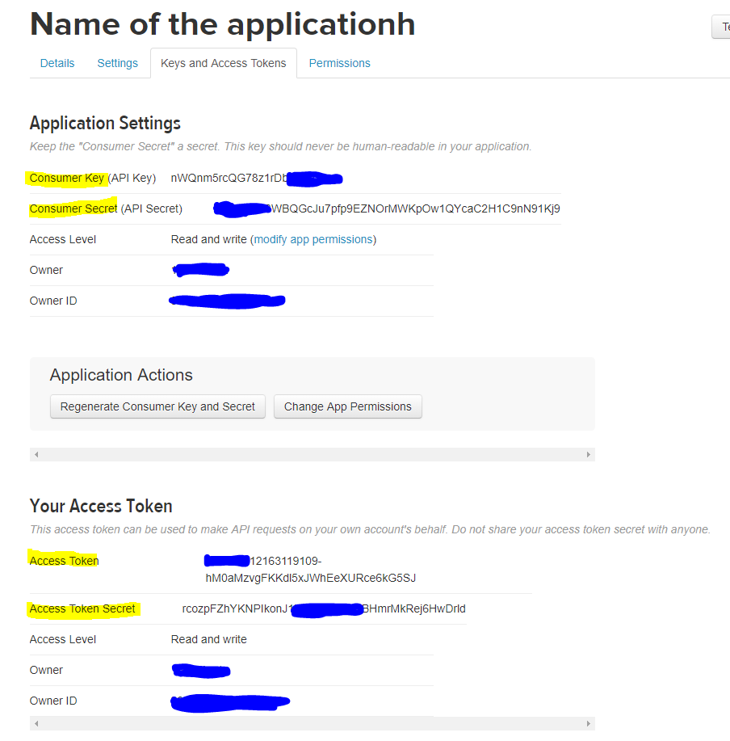

Start text streaming with koshort
=================================

Install Koshort
---------------

Installing koshort with Python3 and pip is easy with one-line of code.

.. code-block:: bash

    $ pip install koshort

Koshort streaming API
---------------------

When you use koshort streaming API, koshort will automacally make directory called "data" 
where all the data saved. Every streamer API will save collected text to "data" directory by default.

Streaming Naver trends
----------------------

Naver is a most famous Korean search engine website and they provides the most searched keywords. You can stream naver's realtime trends with custom intervals you set.

* Python

.. code-block:: python

    >>> from koshort.stream import NaverStreamer
    >>> streamer = NaverStreamer()
    >>> streamer.options.verbose = True  # Print streaming results.
    >>> streamer.options.display_rank = True  # Print ranking of the keywords.
    >>> streamer.n_limits = 5  # stop streaming when n amount of data gathered.
    >>> streamer.stream(interval=30)  # crawl every 30 seconds.
    cj채용
    온주완의 뮤직쇼
    유상무
    현대차
    ...

* Command-line script

.. code-block:: bash
    
    $ stream_naver
    display_rank = False
    filename = trends.txt
    interval = 60
    n_limits = 10
    verbose = True
    양예원
    정성종
    버닝
    나의 아저씨
    이소윤
    국가장학금

Streaming filtered tweets
-------------------------

Twitter is one of the best source to find a Korean spoken-language and short messages. (where idea of the name Koshort came from)
You can stream tweets by defining multiple **keywords** (If you don't specify the keywords "가","나","다","라","마"... is your default keywords) you like and each tweets will be automacally classified with number of keywords.

When **--verbose** option is True, your **keywords** will be appear with color in the command-line

You can filter tweets using **--remove_links**, **--remove_mentions**, **filter_retweets**.

Create twitter app to use twitter API
-------------------------------------

If you don't already have a twitter API access, please click `here. <https://apps.twitter.com/>`_

Click "Create New App" button to create your twitter app.

Click "Create your Twitter application" button after writing details.

Click "Keys and Access Tokens" to get your own API keys and tokens. 

Copy your keys and tokens to your code.

* Python

.. code-block:: python

    >>> import sys
    >>> import os
    >>> from koshort.stream import TwitterStreamer
    >>> # Initialize streamer with path to save data and [list of words] to be used in streaming.
    >>> app = TwitterStreamer("data/", ["가","나","다","라"], async=True)  # You can use out-of-the-box Threading with async=True
    >>> # Show options available
    >>> app.show_options()
    access_token = None
    access_token_secret = None
    consumer_key = None
    consumer_secret = None
    filter_retweets = False
    output_as_onefile = False
    output_extension = txt
    output_prefix = tweet
    remove_links = False
    remove_mentions = False
    tweet_limits = 1000000
    verbose = False
    >>> # Set the options you desire
    >>> # Underlining consumer key, consumer secret, access token, access token secret must be provided.
    >>> app.options.consumer_key = '' 
    >>> app.options.consumer_secret = ''
    >>> app.options.access_token = ''
    >>> app.options.access_token_secret = ''
    >>> app.options.filter_retweets=True
    >>> app.options.output_extension='twt'
    >>> app.options.output_prefix=''
    >>> app.options.remove_links=True
    >>> app.options.remove_mentions=True
    >>> app.options.tweet_limits=10
    >>> app.options.verbose=True
    >>> # Initialize application and launch it
    >>> app.create_listener()
    >>> app.stream()
    2 오늘ㄴ셤끗나면 파판안하고 그림그려야지 컴션 다 끗내고싶어 낼까지
    1  다 #더쇼 #빅스LR 투표
    2 월요일에 브레이커스에 가서 기점이를 만났어!!일도 잘하고 다 완벽해!!!!!!!!!!
    3  죠아욥 ㅠ 근데 나 돈이없어서 s나 a가 학생할인되길래 할건데 괭ㅌ찮아?
    2 나 지금 드려야할 깊티가 5개인데 월급이 안들어옴 ㅅㅂ
    4 6. 비슷 한 뜻을 가진 단어 들을 사전으로 다 열람 해 본 후 선택해서 쓰는 소소한 재미를 즐기기도 합니다. 아직 공개하지 않은 글 이지만 아주 예전부터 쓰고 싶어서 저장만 해 둔 필연 이라는 글이 있는데… 
    1  와악 나 루날님한테 물어볼 거 많을 것 같아요 ㅇ&lt;-&lt;
    2  저는 치킨은 다 좋아해요
    치느님 앞에서 감히 취향을 논하다니 그거슨 넘 건방진 것 '^'
    1  와 민현풀셋이시네요😙 저는 다 교환으로 꾸렸죠...
    1 ? 이게 다 무슨소리야 씹뽤

* Command-line script

.. code-block:: bash
    
    $ stream_twitter --help  # Check entire options
    usage: stream_twitter [-h] [-v] --consumer_key CONSUMER_KEY --consumer_secret
                      CONSUMER_SECRET --access_token ACCESS_TOKEN
                      --access_token_secret ACCESS_TOKEN_SECRET
                      [--filter_retweets] [--remove_links] [--remove_mentions]
                      [--output_prefix OUTPUT_PREFIX] [--output_as_onefile]
                      [--output_extension OUTPUT_EXTENSION]
                      [--tweet_limits TWEET_LIMITS]
                      [--time_limits TIME_LIMITS]

    optional arguments:
    -h, --help            show this help message and exit
    -v, --verbose         increase verbosity
    --consumer_key CONSUMER_KEY
                            consumer key
    --consumer_secret CONSUMER_SECRET
                            consumer secret
    --access_token ACCESS_TOKEN
                            access token
    --access_token_secret ACCESS_TOKEN_SECRET
                            access token secret
    --filter_retweets     do not save potentially repetitive retweets
    --remove_links        remove links included into each tweet
    --remove_mentions     remove mentions included into each tweet
    --output_prefix OUTPUT_PREFIX
                            prefix of the output file
    --output_as_onefile   save output as onefile
    --output_extension OUTPUT_EXTENSION
                            extension of the output file
    --tweet_limits TWEET_LIMITS
                            stop when this amount of tweets are collected
    --time_limits TIME_LIMITS
                            stop when n secs elapsed

    # One line of code!
    $ stream_twitter --consumer_key=CONSUMER_KEY --consumer_secret CONSUMER_SECRET \
    --access_token ACCESS_TOKEN --access_token_secret ACCESS_TOKEN_SECRET
    access_token = 
    access_token_secret = 
    consumer_key = 
    consumer_secret = 
    filter_retweets = False
    output_as_onefile = False
    output_extension = txt
    output_prefix = tweet
    remove_links = False
    remove_mentions = False
    time_limits = 1000000
    tweet_limits = 1000000
    verbose = True
    2 오늘ㄴ셤끗나면 파판안하고 그림그려야지 컴션 다 끗내고싶어 낼까지
    1  다 #더쇼 #빅스LR 투표
    2 월요일에 브레이커스에 가서 기점이를 만났어!!일도 잘하고 다 완벽해!!!!!!!!!!
    3  죠아욥 ㅠ 근데 나 돈이없어서 s나 a가 학생할인되길래 할건데 괭ㅌ찮아?
    2 나 지금 드려야할 깊티가 5개인데 월급이 안들어옴 ㅅㅂ
    4 6. 비슷 한 뜻을 가진 단어 들을 사전으로 다 열람 해 본 후 선택해서 쓰는 소소한 재미를 즐기기도 합니다. 아직 공개하지 않은 글 이지만 아주 예전부터 쓰고 싶어서 저장만 해 둔 필연 이라는 글이 있는데…
    1  와악 나 루날님한테 물어볼 거 많을 것 같아요 ㅇ&lt;-&lt;
    2  저는 치킨은 다 좋아해요
    치느님 앞에서 감히 취향을 논하다니 그거슨 넘 건방진 것 '^'
    1  와 민현풀셋이시네요😙 저는 다 교환으로 꾸렸죠...
    1 ? 이게 다 무슨소리야 씹뽤